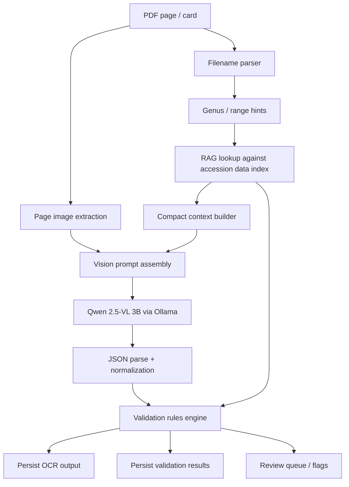

# Specification: RAG-Guided OCR Pipeline for Propagation Card Reader

## 1. Overview & motivation

The current propagation card reader is a **single-pass vision OCR pipeline**: extract a page image from a scanned PDF, send it to a local vision model, parse JSON, and store the result. That works surprisingly well, but it treats each card as if it exists in a vacuum.

Propagation cards do **not** exist in a vacuum. They were created inside a botanical garden accession system with stable numbering patterns, taxonomic conventions, item suffixes, date ranges, and institutional spelling habits. The garden already has that knowledge in its accession exports. The proposed RAG layer uses that internal knowledge to:

- improve OCR accuracy,
- reduce hallucinated accession numbers,
- distinguish valid from invalid accession formats,
- catch taxonomic conflicts,
- surface likely spelling corrections,
- preserve legitimate blank accessions on failed germination cards,
- and make the pipeline portable to other gardens by moving garden-specific rules into configuration and data.

In short: the model should stop guessing blindly and start reading *with context*.

---

## 2. Current pipeline (brief)

Current implementation, based on `run.py`, `worker.py`, and `schema.py`:

1. `inventory` scans PDFs and inserts one row per page into `cards`.
2. `process` loops through `pending` cards.
3. `worker.extract_page_image()` renders a PDF page to PNG.
4. `worker.call_ollama()` sends the image and a fixed prompt to Qwen 2.5-VL 3B via Ollama.
5. `worker.parse_json_response()` extracts JSON from the model response.
6. Results are written to:
   - `extractions` (botanical name, propagation text, raw JSON, timing)
   - `accession_numbers` (one row per extracted accession string)

Current prompt:

```text
Read this scanned botanical garden propagation card. Extract as JSON:
{"accession_number": ["..."], "botanical_name": "...", "propagation_text": "full text as written"}
If multiple accession numbers exist, list all. Read numbers precisely.
```

### Current strengths
- Simple and understandable.
- Fully local.
- Good baseline accuracy.
- Existing database and run tracking already support incremental improvement.

### Current limitations
- No use of filename clues.
- No knowledge of valid accession formats.
- No taxonomic grounding.
- No validation against known accession history.
- No distinction between plausible OCR output and institutionally impossible output.
- No support for blank accession as a legitimate state on older failed-germination cards.

---

## 3. Proposed architecture (diagram-friendly description)

The proposed design keeps the current OCR core but adds a lightweight retrieval and validation layer around it.



### Design principle
Use RAG as a **small, high-precision guidance layer**, not a giant document dump. The model only needs a concise context block containing the most relevant institutional facts for the current card.

### Processing modes
- **Mode 1: OCR only** — preserve current behavior for debugging and A/B testing.
- **Mode 2: OCR + RAG guidance** — improved prompt, no hard validation gate.
- **Mode 3: OCR + RAG + validation** — production mode with confirmation/flagging logic.

---

## 4. Filename convention recommendation

Filename hints are cheap, often reliable, and available before OCR. They should be used.

## 4.1 Current-state parsing requirements

Current filenames are inconsistent, e.g.:

- `sorbus_4.pdf`
- `Ber-bet.pdf`
- `Adouble7.pdf`
- `Beg-ber.pdf`
- `Scan2025-07-23_sag_sal.pdf`

The parser must support both:

1. **messy legacy names**, and
2. **a future clean naming convention**.

## 4.2 Recommended clean convention

Recommended canonical filename format:

```text
[scan-date__]scope[__mode].pdf
```

Where:

- `scan-date` = optional `YYYY-MM-DD`
- `scope` = either one genus or a genus range
- `mode` = optional `simplex` or `duplex`

Examples:

```text
sorbus.pdf
berberis-betula.pdf
2025-07-23__sagina-salix.pdf
2025-07-23__sorbus__duplex.pdf
```

### Recommendation
Use **full genus names** in lowercase, separated by hyphens for ranges and double underscores for optional metadata.

Why this works:
- human-readable,
- machine-parseable,
- robust across platforms,
- easy to sort,
- avoids ambiguity from three-letter fragments.

## 4.3 Filename parsing rules

### Clean-name parser
If filename matches the canonical pattern:
- `sorbus.pdf` → single genus hint: `Sorbus`
- `berberis-betula.pdf` → genus range hint: `Berberis` to `Betula`
- `2025-07-23__sorbus__duplex.pdf` → same, plus `scan_date` and `duplex=true`

### Legacy-name heuristics
For existing files:

1. Normalize filename stem:
   - lowercase
   - remove scan prefixes (`scan`, numeric counters, etc.)
   - convert `_` to `-`
   - strip extension

2. Duplex exclusion:
   - if stem contains `duplex` or `double`, mark file **excluded for now**.

3. Try direct genus token match against known genera from accession data.
   - `sorbus_4` → `sorbus` → `Sorbus`

4. If token looks like prefix range (`ber-bet`, `beg-ber`, `sag_sal`):
   - split on delimiters,
   - interpret each token as a prefix,
   - match to known genera whose names start with the prefix,
   - keep all plausible genus candidates,
   - prefer exact/full genus matches over prefix expansions,
   - for two-prefix ranges, retrieve genera alphabetically between the resolved bounds.

5. If no reliable hint is found:
   - proceed with no genus hint,
   - fall back to broader retrieval.

## 4.4 Suggested parser output structure

```json
{
  "raw_filename": "Scan2025-07-23_sag_sal.pdf",
  "normalized_stem": "2025-07-23-sag-sal",
  "scan_date": "2025-07-23",
  "duplex": false,
  "hint_mode": "range_prefix",
  "genus_candidates": ["Sagina", "Salix", "Salvia"],
  "range_start": "Sagina",
  "range_end": "Salix",
  "confidence": 0.72
}
```

---

## 5. RAG data preparation (how to index accession data)

Foundation data available:

- `accession_history.csv` — accession-level history, 36,984 rows × 171 columns
- `accession_item_history.csv` — item-level history, 141,422 rows × 76 columns

These should not be queried as raw CSVs for every card. Build a normalized local index optimized for retrieval.

## 5.1 Data products to build

### A. `rag_accessions`
Derived primarily from `accession_history.csv`.

Purpose:
- accession existence check,
- accession-to-taxon lookup,
- genus/taxon spelling inventory,
- year range logic,
- provenance and collection metadata when useful.

Suggested normalized columns:

```text
accession_number
accession_format_type          -- legacy | modern
accession_year
genus
species
infra_text
taxon_name
taxon_name_full
family
collector
collection_date
country
provenance_code
is_current
source_row_hash
```

### B. `rag_items`
Derived primarily from `accession_item_history.csv`.

Purpose:
- valid item suffix inventory,
- accession item examples,
- treatment/sowing interpretation,
- status hints.

Suggested normalized columns:

```text
item_accession_number          -- e.g. 2019-0082.99
parent_accession_number        -- e.g. 2019-0082
item_suffix                    -- 99
genus
taxon_name
item_status
item_type
propagule
prop_comment
source_row_hash
```

### C. `rag_taxa`
Distinct taxonomic lexicon derived from both exports.

Purpose:
- valid spelling lookup,
- fuzzy correction candidate generation,
- genus range expansion for filename parsing.

Suggested columns:

```text
genus
genus_normalized
taxon_name
taxon_name_normalized
taxon_name_full
family
observation_count
first_accession_year
last_accession_year
```

### D. `rag_filename_genus_index`
Compact list of genera and common prefixes.

Purpose:
- quickly resolve `ber-bet`, `sag_sal`, etc.

Suggested columns:

```text
genus
prefix_3
prefix_4
prefix_5
sort_key
accession_count
```

## 5.2 Storage choice

Recommended implementation:
- keep source CSVs as immutable inputs,
- build a **local SQLite RAG index** alongside `cards.db` or as `rag.db`.

Why SQLite:
- already used in project,
- easy distribution,
- supports indexed lookups,
- can include FTS or trigram-like helper tables if needed,
- avoids loading full CSVs in memory every run.

## 5.3 Normalization rules

Normalize for retrieval, but retain original values for reporting.

### Accession normalization
Store:
- raw OCR string,
- normalized accession string,
- parent accession string,
- item suffix if present.

Normalization rules:
- trim whitespace,
- convert em/en dash to `-`,
- remove internal spaces around separators,
- preserve leading zeros,
- uppercase if alphabetic content ever appears,
- preserve decimal suffix `.NN`.

### Taxon normalization
Store both original and normalized forms:
- lowercase,
- collapse repeated spaces,
- strip authorship for comparison path,
- optionally remove punctuation except hybrid markers and meaningful separators.

### Date normalization
Derive from accession number where possible:
- legacy: year is the final two-digit segment, mapped by data-backed century logic,
- modern: year is the leading four digits.

## 5.4 Retrieval units

The context builder should retrieve **small structured facts**, not raw rows.

Good retrieval units:
- valid accession examples for the candidate genus,
- known spellings for that genus,
- observed item suffixes for matching accessions,
- presence/absence of accession number,
- accession-to-taxon confirmation.

Bad retrieval units:
- whole CSV rows dumped into prompt,
- large provenance text blocks,
- unused administrative fields.

---

## 6. Per-card processing flow (detailed)

## 6.1 Step 0 — inventory and exclusion

When inventorying or pre-processing files:

- detect `duplex` or `double` in filename,
- set `excluded_reason = duplex_pending`,
- do not enqueue for OCR in current phase.

This keeps the main pipeline clean and prevents interleaved front/back confusion.

## 6.2 Step 1 — filename hint extraction

Input: `pdf_path`, `page_num`

Output:
- normalized filename metadata,
- genus candidates,
- optional scan date,
- duplex flag,
- parser confidence.

Pseudo-flow:

```text
parse_filename(pdf_name)
  -> if duplex/double => exclude
  -> try canonical parser
  -> else try legacy heuristics
  -> emit genus candidates / range
```

## 6.3 Step 2 — candidate retrieval

Given filename hints, retrieve a compact garden-specific context.

### Retrieval strategy by confidence

#### High-confidence single genus
If parser confidently resolves a single genus, e.g. `Sorbus`:
- retrieve top taxa for `Sorbus`,
- retrieve accession examples for that genus,
- retrieve common item suffixes,
- retrieve year span represented in the data.

#### Range hint
If file spans a range, e.g. `Berberis-Betula`:
- retrieve all genera alphabetically in range,
- cap the number of distinct genera included in prompt,
- include only the most frequent taxa or accession examples.

#### No hint
If no reliable genus hint exists:
- retrieve only global accession format rules,
- optionally include a very small garden taxon lexicon based on OCR first-pass fallback (see optional two-pass strategy below).

## 6.4 Step 3 — compact context construction

The context block should be **small enough to help, not overwhelm**.

Recommended context sections:

1. **Garden rules**
2. **Filename hints**
3. **Known genera/taxa**
4. **Accession examples**
5. **Item suffix examples**
6. **Blank-accession policy**

Example context block:

```text
Garden accession rules:
- Legacy format: NNNNN-NNN-NN (example: 21420-027-82)
- Modern format: YYYY-NNNNN (example: 2015-00444)
- Item suffix: .NN (example: 2019-0082.99)
- Bare numbers like 1 or 3 are not valid accessions
- Blank accession may be legitimate on pre-2012 failed germination cards

Filename hint:
- File suggests genus range Sagina–Salix

Known genera/taxa seen in this scope:
- Sagina procumbens
- Salix hookeriana
- Salix scouleriana
- Salvia officinalis

Example accessions from this scope:
- 2015-00444 -> Salix hookeriana
- 2019-0082.99 -> Salvia officinalis
- 21420-027-82 -> Sagina procumbens

Observed item suffixes:
- .80 .81 .82 .89 .99
```

## 6.5 Step 4 — context-enriched OCR prompt

Send image + context + output schema to Qwen.

The model prompt should explicitly instruct the model to:
- prefer exact transcription over inference,
- use the context only as guidance,
- not hallucinate absent accession numbers,
- distinguish valid accession formats from stray integers,
- preserve uncertain values in explicit confidence fields or note fields.

## 6.6 Step 5 — JSON parse and normalization

After model response:
- parse JSON using existing tolerant parser,
- normalize accession strings,
- normalize botanical name for comparison,
- keep raw output unchanged for auditability.

## 6.7 Step 6 — validation pass

Run deterministic validation rules against the RAG index.

Validation outputs should classify fields as:
- `confirmed`
- `plausible`
- `corrected_candidate`
- `missing_but_allowed`
- `conflict`
- `invalid`
- `unknown`

## 6.8 Step 7 — persistence

Store:
- OCR output,
- retrieval context metadata,
- validation results,
- review flags,
- any suggested corrections.

## 6.9 Optional future enhancement: two-stage retrieval

If filename hints are weak, a future variant can do:

1. cheap first OCR pass with no RAG,
2. retrieve using tentative genus/taxon text,
3. rerun prompt with targeted context.

This is useful but should be phase 2 or 3, not required for the initial RAG rollout.

---

## 7. Prompt engineering (show example prompts with/without RAG context)

## 7.1 Baseline prompt (current behavior)

```text
Read this scanned botanical garden propagation card. Extract as JSON:
{"accession_number": ["..."], "botanical_name": "...", "propagation_text": "full text as written"}
If multiple accession numbers exist, list all. Read numbers precisely.
```

## 7.2 Recommended RAG prompt

```text
You are reading a scanned botanical garden propagation card.

Your job is transcription first, not invention.
Use the provided garden context only to guide recognition and validation.
Do not hallucinate accession numbers that are not visible.
If the card has no accession number, return an empty list.
A bare number like "1" or "3" is not a valid accession unless it is clearly part of a full accession format.

Return JSON only using this schema:
{
  "accession_number": ["..."],
  "botanical_name": "...",
  "propagation_text": "full text as written",
  "notes": "optional brief note about uncertainty"
}

Garden context:
- Legacy accession format: NNNNN-NNN-NN (example: 21420-027-82)
- Modern accession format: YYYY-NNNNN (example: 2015-00444)
- Item accession format: YYYY-NNNNN.NN or YYYY-NNNN.NN depending on recorded data examples
- Common item suffixes: .80 .81 .82 .89 .99
- Blank accession may be legitimate on older failed-germination cards

Filename hint:
- Likely genus or range: Sorbus

Known taxa in this scope:
- Sorbus aucuparia
- Sorbus aria
- Sorbus scopulina

Example known accession mappings:
- 2015-00444 -> Sorbus aucuparia
- 21420-027-82 -> Sorbus aria
- 2019-0082.99 -> Sorbus scopulina

Instructions:
- Read what is on the card.
- If the visible accession differs from the examples, transcribe what is visible.
- If botanical spelling is unclear, prefer the closest visible spelling rather than guessing.
- Keep propagation_text as a faithful transcription.
```

## 7.3 Notes on prompt design

### Keep context compact
For a 3B vision model, the useful prompt budget is limited. The context should generally stay within roughly **300-800 words** and preferably much smaller for routine cards.

### Prefer lists over prose
Structured bullets are easier for the model to use than paragraphs.

### Use examples sparingly
A handful of accession examples is enough. Too many examples may bias the model toward copying instead of reading.

### Distinguish transcription from validation
The prompt should guide recognition, but the hard judgment should happen in deterministic code afterward.

---

## 8. Validation logic (rules engine)

The validation pass is where institutional knowledge becomes explicit and auditable.

## 8.1 Accession format rules

Based on `ACCESSION-FORMATS.md`:

### Legacy accession
```regex
^\d{5}-\d{3}-\d{2}$
```
Example: `21420-027-82`

### Modern accession
```regex
^\d{4}-\d{5}$
```
Example: `2015-00444`

### Modern/item accession
Primary target rule:
```regex
^\d{4}-\d{4,5}\.\d{2}$
```
Examples:
- `2019-0082.99`
- `2019-00082.99` if data ever contains 5-digit parent bodies

Implementation note: item regex should be driven by observed accession data, not frozen prematurely. The export should be used to determine whether the parent body is 4 or 5 digits in practice.

### Invalid examples
- `1`
- `3`
- `...`
- partially read fragments like `2015`

These are not valid accession numbers, though blank may still be legitimate.

## 8.2 Accession validation states

For each extracted accession candidate:

### A. Exists exactly in accession index
Result:
- `status = confirmed`
- include linked taxon and genus

### B. Exists as parent accession, item suffix absent/misread
Example:
- OCR: `2019-0082`
- Index contains: `2019-0082.99`

Result:
- `status = plausible`
- suggest possible item forms

### C. Format valid but accession not found
Result:
- `status = plausible`
- `review_flag = missing_in_export`

Use case:
- OCR may be correct but export incomplete or card not represented in current data snapshot.

### D. Format invalid
Result:
- `status = invalid`
- `review_flag = invalid_format`

### E. Blank accession
If accession list is empty:
- if card appears pre-2012 or other cues suggest failed germination, `missing_but_allowed`
- otherwise `unknown`

Important: do **not** auto-penalize blank accessions on older cards.

## 8.3 Botanical name validation

For extracted `botanical_name`:

### A. Exact normalized taxon match in retrieved scope
- `confirmed`

### B. Exact genus match + fuzzy species match
- `corrected_candidate`
- store suggestion and similarity score

### C. Fuzzy full-taxon match across garden lexicon
- `corrected_candidate`
- only if above threshold

### D. No meaningful match
- `unknown`

Suggested comparison stages:
1. exact normalized taxon match,
2. exact genus + fuzzy epithet,
3. fuzzy full taxon,
4. genus-only fallback.

## 8.4 Cross-field consistency checks

These checks are especially valuable.

### Accession ↔ taxon consistency
If accession is confirmed and linked taxon conflicts with OCR botanical name:
- `status = conflict`
- example: accession belongs to `Sorbus aria`, OCR reads `Salix alba`

### Accession ↔ filename hint consistency
If filename hint strongly suggests `Sorbus` and OCR reads `Quercus`, this is not proof of error but should lower confidence.

### Taxon ↔ filename range consistency
If OCR taxon falls outside the resolved genus range, flag for review.

## 8.5 Suggested rule engine output

```json
{
  "accession_checks": [
    {
      "raw": "2019-0082.99",
      "normalized": "2019-0082.99",
      "format_type": "item",
      "status": "confirmed",
      "matched_taxon": "Sorbus scopulina",
      "matched_genus": "Sorbus"
    }
  ],
  "taxon_check": {
    "raw": "Sorbus scopulina",
    "normalized": "sorbus scopulina",
    "status": "corrected_candidate",
    "suggested_taxon": "Sorbus scopulina",
    "similarity": 0.97
  },
  "consistency_checks": [
    {
      "type": "accession_taxon_conflict",
      "status": "pass"
    }
  ],
  "overall_status": "review"
}
```

## 8.6 Confidence scoring

Use confidence as a derived score, not a raw model truth.

Example weighted approach:
- +0.45 accession exact match
- +0.25 taxon exact match
- +0.10 filename hint agreement
- +0.10 valid accession format
- +0.10 propagation text non-empty and parseable
- large penalties for accession/taxon conflict or invalid format

Then bucket into:
- `high`
- `medium`
- `low`

This is easier to reason about than pretending the model can provide calibrated confidence by itself.

---

## 9. Database schema changes

The current schema is a good base. The main change is to preserve retrieval and validation as first-class artifacts.

## 9.1 Minimal-change strategy

Keep existing tables:
- `processing_runs`
- `cards`
- `extractions`
- `accession_numbers`

Add new tables for retrieval and validation.

## 9.2 Recommended schema additions

### Extend `processing_runs`

```sql
ALTER TABLE processing_runs ADD COLUMN pipeline_mode TEXT;         -- ocr_only | rag_prompt | rag_validate
ALTER TABLE processing_runs ADD COLUMN prompt_version TEXT;
ALTER TABLE processing_runs ADD COLUMN rag_index_version TEXT;
ALTER TABLE processing_runs ADD COLUMN rules_version TEXT;
```

### Extend `cards`

```sql
ALTER TABLE cards ADD COLUMN pdf_filename TEXT;
ALTER TABLE cards ADD COLUMN duplex_flag INTEGER DEFAULT 0;
ALTER TABLE cards ADD COLUMN excluded_reason TEXT;
ALTER TABLE cards ADD COLUMN filename_hint_json TEXT;
```

### Extend `extractions`

```sql
ALTER TABLE extractions ADD COLUMN normalized_botanical_name TEXT;
ALTER TABLE extractions ADD COLUMN prompt_text TEXT;
ALTER TABLE extractions ADD COLUMN prompt_context TEXT;
ALTER TABLE extractions ADD COLUMN validation_status TEXT;
ALTER TABLE extractions ADD COLUMN confidence_score REAL;
ALTER TABLE extractions ADD COLUMN confidence_bucket TEXT;
```

### Extend `accession_numbers`

```sql
ALTER TABLE accession_numbers ADD COLUMN normalized_accession_number TEXT;
ALTER TABLE accession_numbers ADD COLUMN format_type TEXT;
ALTER TABLE accession_numbers ADD COLUMN validation_status TEXT;
ALTER TABLE accession_numbers ADD COLUMN matched_accession_number TEXT;
ALTER TABLE accession_numbers ADD COLUMN matched_taxon_name TEXT;
ALTER TABLE accession_numbers ADD COLUMN review_flag TEXT;
```

### New table: `rag_contexts`
Stores what retrieval context was assembled for each card.

```sql
CREATE TABLE IF NOT EXISTS rag_contexts (
    id INTEGER PRIMARY KEY AUTOINCREMENT,
    card_id INTEGER NOT NULL,
    retrieval_query_json TEXT,
    context_text TEXT,
    context_token_estimate INTEGER,
    retrieval_latency_ms INTEGER,
    created_at TEXT NOT NULL,
    FOREIGN KEY (card_id) REFERENCES cards(id)
);
```

### New table: `validation_results`
Stores rule-engine output independent of extraction tables.

```sql
CREATE TABLE IF NOT EXISTS validation_results (
    id INTEGER PRIMARY KEY AUTOINCREMENT,
    extraction_id INTEGER NOT NULL,
    overall_status TEXT,
    taxon_status TEXT,
    taxon_suggested TEXT,
    taxon_similarity REAL,
    accession_summary_json TEXT,
    consistency_summary_json TEXT,
    rules_version TEXT,
    created_at TEXT NOT NULL,
    FOREIGN KEY (extraction_id) REFERENCES extractions(id)
);
```

### New table: `review_queue`
Optional but useful for manual triage.

```sql
CREATE TABLE IF NOT EXISTS review_queue (
    id INTEGER PRIMARY KEY AUTOINCREMENT,
    card_id INTEGER NOT NULL,
    extraction_id INTEGER,
    reason TEXT NOT NULL,
    severity TEXT,
    status TEXT DEFAULT 'open',
    created_at TEXT NOT NULL,
    resolved_at TEXT,
    notes TEXT,
    FOREIGN KEY (card_id) REFERENCES cards(id),
    FOREIGN KEY (extraction_id) REFERENCES extractions(id)
);
```

## 9.3 Separate RAG index database

Recommended separate database: `rag.db`

Reason:
- keeps OCR run data separate from source-derived knowledge index,
- easier rebuilds when CSV exports change,
- cleaner portability.

---

## 10. Truthing strategy (using existing 1,919 cards)

The 1,919 already-processed cards are the right evaluation set for the first RAG rollout.

## 10.1 Evaluation goals

Measure whether RAG improves:
- accession accuracy,
- taxon accuracy,
- invalid accession rejection,
- blank-accession handling,
- downstream review prioritization.

## 10.2 Experimental design

Run three comparable modes on the same card set:

1. **Baseline** — current OCR pipeline
2. **RAG prompt only** — retrieval context added, no validation enforcement
3. **RAG prompt + validation** — full proposed pipeline

## 10.3 Comparison outputs

For each card, compare:
- accession(s) extracted,
- botanical name extracted,
- propagation text presence/quality,
- validation state,
- whether card entered review queue.

## 10.4 Core metrics

### Accession metrics
- exact accession match rate
- accession format validity rate
- accession validation hit rate (`OCR accession found in accession index`)
- false positive accession rate (model outputs accession where none should exist)

### Botanical name metrics
- exact normalized taxon match rate
- genus-only match rate
- suggested-correction usefulness rate

### Review metrics
- proportion of cards flagged for review
- precision of review flags on sampled manual audit
- conflict detection count

### Operational metrics
- mean latency/card
- mean retrieval latency/card
- total throughput change vs baseline

## 10.5 Ground-truth interpretation

The 1,919 prior outputs are a **truth source for comparison**, but they are not necessarily perfect gold labels.

Recommended approach:
- treat existing outputs as the working reference set,
- manually audit a stratified subset where:
  - baseline and RAG disagree,
  - RAG flags conflicts,
  - blank accessions occur,
  - legacy-format cards occur.

This avoids overfitting to earlier OCR mistakes.

## 10.6 Suggested truthing reports

Produce at least:

1. `truthing_summary.csv`
2. `truthing_disagreements.csv`
3. `review_flag_sample.csv`
4. a short markdown report with confusion-style summaries

Example disagreement schema:

```text
card_id,pdf_file,page_num,baseline_accession,rag_accession,baseline_taxon,rag_taxon,validation_status,requires_manual_review
```

---

## 11. Portability (other gardens)

This design should be portable by making the garden-specific parts declarative.

## 11.1 What another garden would need

Minimum inputs:

1. scanned card PDFs,
2. accession export CSV(s),
3. field mapping config,
4. accession format rules config.

## 11.2 What must be configurable

### A. CSV field mapping
Different gardens will not use the same export schema.

Suggested config structure:

```yaml
source:
  accession_csv: accession_history.csv
  item_csv: accession_item_history.csv
fields:
  accession_number: AccNoFull
  item_accession_number: ItemAccNoFull
  genus: Genus
  taxon_name: TaxonName
  taxon_name_full: TaxonNameFull
  family: Family
  collection_date: CollDate
```

### B. Accession format rules
Do not hardcode UBC-only formats in code.

Suggested config structure:

```yaml
accession_rules:
  blank_accession_allowed:
    condition: legacy_failed_germination
  patterns:
    - name: legacy
      regex: '^\\d{5}-\\d{3}-\\d{2}$'
    - name: modern
      regex: '^\\d{4}-\\d{5}$'
    - name: item
      regex: '^\\d{4}-\\d{4,5}\\.\\d{2}$'
  invalid_examples:
    - '1'
    - '3'
```

### C. Filename parsing rules
Different gardens may have different scan naming habits.

Suggested config sections:
- duplex indicators,
- date patterns,
- delimiter rules,
- prefix expansion policy.

## 11.3 Portable architecture principle

The portable unit is:

```text
garden scans + garden accession export + garden config = garden-specific OCR assistant
```

That is the real value of this design. The model remains generic; the garden knowledge becomes pluggable.

---

## 12. Performance estimates

RAG lookup adds latency, but this should be modest if implemented as indexed local lookup.

## 12.1 Baseline cost components

Current per-card cost is roughly:
- PDF page render
- image encode
- Ollama inference
- JSON parse
- DB write

The dominant cost is almost certainly **vision model inference**.

## 12.2 Estimated RAG overhead

With a local SQLite index and cached genus lookups:

- filename parse: ~1-5 ms
- local retrieval: ~5-30 ms typical
- context assembly: ~1-10 ms
- validation rules: ~1-10 ms

Expected added overhead per card:
- **uncached typical**: ~10-50 ms
- **cached genus scope**: often <10 ms incremental

That means RAG should usually add **well under 1 second/card**, and more realistically only a small percentage relative to vision inference time.

## 12.3 Caching opportunities

Many cards in a file or run share the same genus or genus range.

Recommended caches:
- parsed filename → filename metadata
- genus/range scope → compact prompt context
- accession string → validation result
- taxon string → fuzzy-match candidate list

Simple in-process LRU caches should be enough.

## 12.4 Context budget guidance

For a 3B vision model:
- keep garden context concise,
- avoid long taxon lists,
- avoid full row dumps,
- cap examples per genus/range.

Recommended initial caps:
- taxa list: 5-15 entries
- accession examples: 3-10 entries
- item suffixes: unique compact set
- total context: ideally <2 KB text, unless testing shows room for more.

## 12.5 Scaling implications

For ~2,000 cards, the total retrieval overhead is trivial.
For larger future batches, the important parts are:
- one-time index build speed,
- cache hit rate,
- avoiding expensive fuzzy search across the full lexicon on every card.

---

## 13. Implementation plan (phased)

## Phase 1 — RAG index build + filename parser

Deliverables:
- CSV-to-SQLite index builder
- filename parser module
- duplex exclusion logic
- configurable accession regex rules

Outputs:
- `rag.db`
- parser tests
- normalized genus lexicon

## Phase 2 — Retrieval context + prompt integration

Deliverables:
- context builder
- prompt templating
- run mode switch (`ocr_only`, `rag_prompt`)
- context persistence in DB

Outputs:
- side-by-side baseline vs RAG prompt comparison

## Phase 3 — Validation rules engine

Deliverables:
- accession validator
- taxon validator
- consistency checks
- confidence scoring
- review queue

Outputs:
- `rag_validate` mode
- flagged-card reporting

## Phase 4 — Truthing on 1,919 cards

Deliverables:
- batch rerun on known set
- metrics report
- disagreement exports
- manual audit sample

Decision gate:
- confirm whether RAG improves accuracy enough for default use

## Phase 5 — Portability hardening

Deliverables:
- YAML/JSON config for field mapping and accession rules
- garden bootstrap docs
- rebuild scripts for new exports

## Phase 6 — Optional second-pass retrieval

Deliverables:
- OCR-first retrieval fallback for cards with weak filename hints
- selective re-prompting only when needed

This should remain optional unless phase 1-4 show a clear need.

---

## 14. Duplex cards (future work)

Files with `duplex` or `double` in the filename are explicitly **excluded from current processing**.

Reason:
- duplex scans may interleave fronts and backs,
- page order may not map 1:1 to a single card face,
- back sides may contain continuation notes rather than independent records,
- naive OCR would mix unrelated surfaces.

## 14.1 Current policy

- detect duplex markers in filename,
- do not process,
- log exclusion reason.

## 14.2 Future duplex strategy

Future handling should treat duplex scans as a separate ingestion mode.

Potential workflow:

1. detect front/back page pairing,
2. split document into card surfaces,
3. classify page side (`front`, `back`, `unknown`),
4. OCR front first,
5. optionally append back-side text to propagation notes,
6. preserve page linkage in schema.

Suggested future schema additions if needed:

```sql
CREATE TABLE duplex_pairs (
    id INTEGER PRIMARY KEY AUTOINCREMENT,
    pdf_path TEXT NOT NULL,
    front_page_num INTEGER,
    back_page_num INTEGER,
    pairing_confidence REAL,
    created_at TEXT NOT NULL
);
```

---

# Summary recommendation

The right first implementation is **not** a heavy semantic-search system. It is a compact, deterministic, garden-aware retrieval layer built from the accession exports and used in three places:

1. **before OCR** — parse filename hints,
2. **during OCR** — provide small, relevant context to the prompt,
3. **after OCR** — validate and score the result.

That gives most of the benefit with low complexity and keeps the system explainable.

## Recommended initial defaults

- Store source-derived knowledge in a separate `rag.db`
- Use filename hints aggressively but transparently
- Keep prompt context small and structured
- Treat validation as deterministic code, not model judgment
- Preserve blank accession as legitimate where policy allows
- Exclude duplex for now
- Benchmark on the existing 1,919 cards before making RAG the default

If done this way, the pipeline becomes both **smarter for UBC** and **portable to other gardens** without baking garden-specific assumptions into the OCR model itself.
